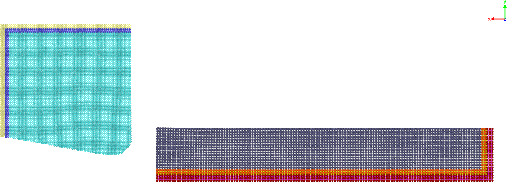
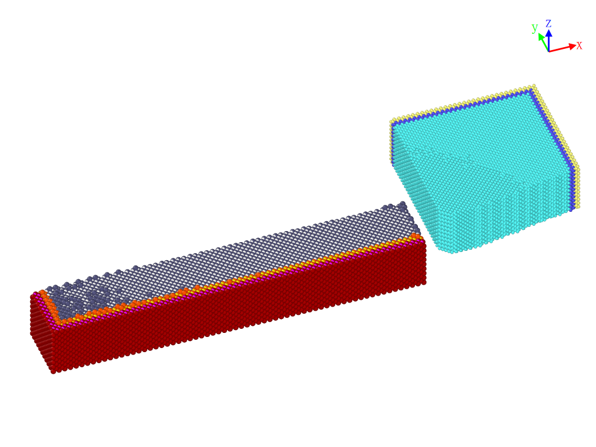

# A LAMMPS Template for Molecular Dynamics Simulation of Nanometric Cutting of 3C-SiC Against A Diamond Tool With A Zero Rake Angle and A Clearance Angle of 10°

This repository contains a LAMMPS template for performing molecular dynamics simulation of nanometric cutting of 3C-SiC against a diamond tool with a zero rake angle and a clearance angle of 10°.

---

## Methodology

### Materials

- Single diamond tool (dimensions: 31[100] 31[010] 22[001] in x, y, and z directions, edge radius: 4 x diamond unit cell, rake angle: 0°, clearance angle: 10°)
- 3C-SiC workpiece (dimensions: 65[010] 10[010] 18[001] in x, y, and z directions)





### Cutting Conditions

- Depth of cut: 5 x 3C-SiC unit cell length
- Cutting direction: [010]<-1 0 0> for ≈200 Å
- Initial temperature: 300 K

### Simulation Settings

1. Equilibration process:

   NVT ensemble, timestep = 0.0005 ps (= 0.5 fs) for 10000 steps

2. Cutting process:

   NVT + NVE ensembles, timestep = 0.0005 ps (= 0.5 fs) for 400000/$v steps

---

## Execution

To run the simulation, you need to have LAMMPS installed on your computer. You can download LAMMPS from https://lammps.sandia.gov/.

**Input files**:

1. in.cutsic_eq_Ltool.lmp
2. in.cutsic_cont_201407201atomistica.lmp

**Input Variables**:

- v - cutting velocity (unit = Å/ps)

**Potential file**:

- [SiC_Erhart-Albe.tersoff](https://www.ctcms.nist.gov/potentials/entry/2005--Erhart-P-Albe-K--Si-C-I/)

To execute the simulation, you can use the following command:

```shell
# Running equilibration process
lmp_serial < in.cutsic_eq_Ltool.lmp -v v 3.0
# Running cutting procoess
lmp_serial < in.cutsic_cont_201407201atomistica.lmp  -v v 3.0
```

This will run the simulation using a single processor. If you want to use multiple processors, you need a multi-core workstation with a LAMMPS MPI executable installed and you use the following command:

```shell
# Running equilibration process
mpirun -np N lmp_mpi < in.cutsic_eq.lmp -v v 3.0
# Running cutting procoess
mpirun -np N lmp_mpi < in.cutsic_cont_201407201atomistica.lmp  -v v 3.0
```

where N is the number of processors you want to use.

The simulation will output several files with different extensions, such as `.log`, `.lammpstrj`, `.restart`, etc. You can use these files to analyze the results of the simulation using various tools, such as OVITO, LAMMPS Pizza.py, Paraview, etc.

## Related Articles

- [Fung, K. Y., Tang, C. Y., and Cheung, C. F. (2017). Molecular dynamics analysis of the effect of surface flaws of diamond tools on tool wear in nanometric cutting. Computational Materials Science, 133, 60–70.](http://www.sciencedirect.com/science/article/pii/S0927025617301180)
